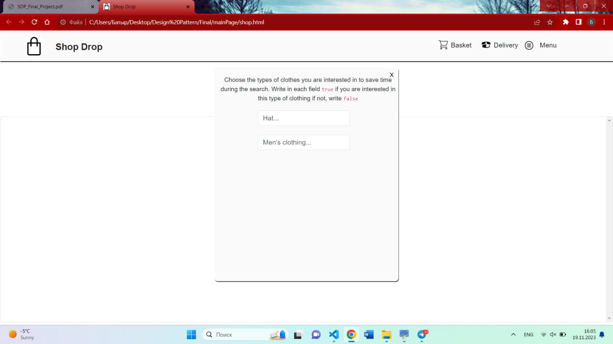
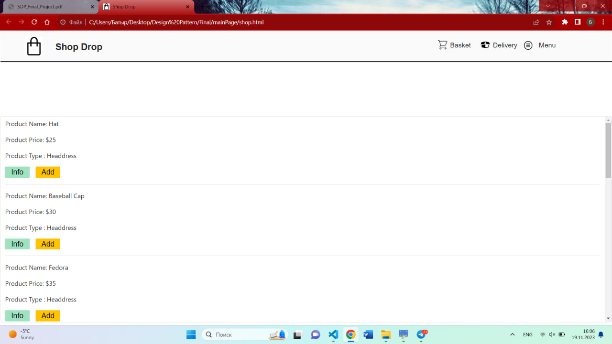
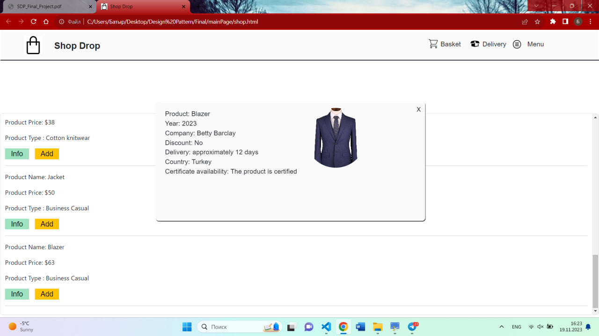
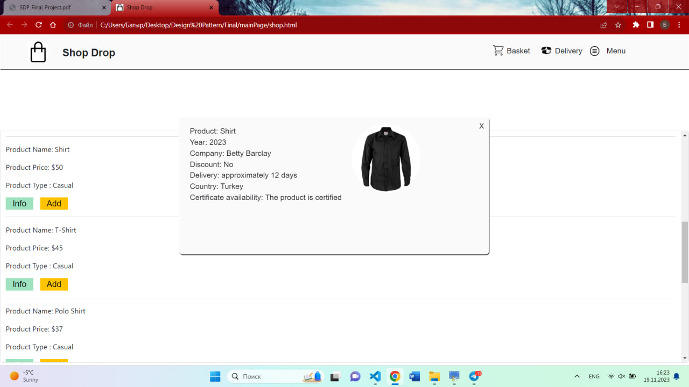
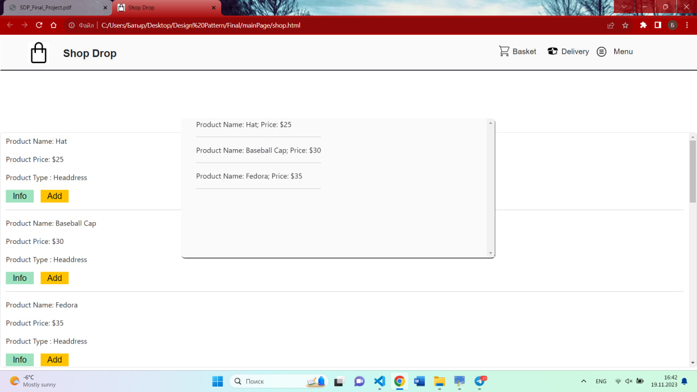
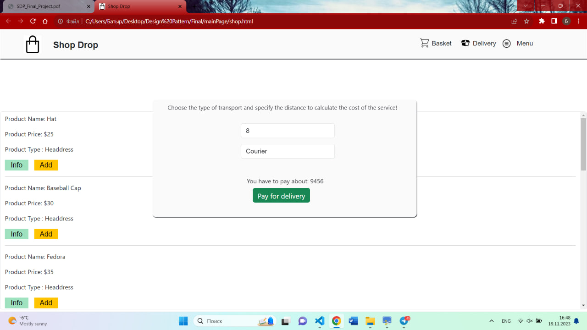
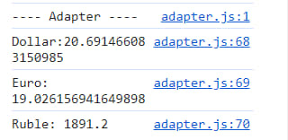
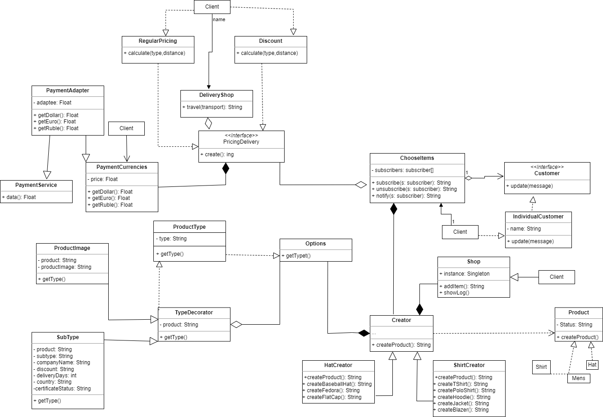

## **Project Name:** Shop Drop(Online clothing store)
## **Group:** SE - 2213
## **Team members:** Ashim Batyr

## Project Overview
+ The theme of my project is an online clothing store where customers can interact with the project using a graphical user interface. The customer can choose the type of product they are interested in and choose clothes. The site provides maximum convenience for the user, where the user can choose the distance, the delivery transport and the amount in 4 currencies will be displayed, so the user can use the delivery function.
---
+ The idea of the project:
  + Creating a basic store using the main web development languages to display products and shopping cart.
  + Creating a simple database for storing information about the store's products and displaying this information on a web page.
  + The use of CSS frameworks (for example, Bootstrap or Tailwind CSS) to improve the appearance of the store and create an adaptive design.
  + Development of the possibility of adding products to the shopping cart.
---
+ The goal of the project:
  + Improving the skills of working with design patterns: Mastering the interaction of patterns to improve the purity of the code and functionality of the store interface.
  + Understanding working with a database: Learning the basics of working with a database to store information about products and store users.
  + Development of the main functionality of the store: Creation of a system for displaying goods and forming a shopping cart.
  + Mastering adaptive design: Exploring approaches to creating mobile-adaptive design for the convenience of using the store on various devices.
  + Optimizing Performance and Loading Speed: Understanding site optimization techniques to speed up its loading and improve the user experience.
  + Improving the User Interface: Learning the principles of improving the user interface using CSS and JavaScript for a more intuitive and engaging experience.
  + Learning the basics of documentation: Mastering the basic principles of documenting code and project to create readable and understandable documentation.
  + Learning the basics of documentation: Mastering the basic principles of documenting code and project to create readable and understandable documentation.
---
+ Project objective:
  + Creation of goods.  Development of a data structure for storing information about goods, their descriptions, prices, availability and other related data.
  + Development of a graphical user interface. Creating a user-friendly and intuitive interface for users, including product pages, shopping baskets, payment pages.
  + Working with payment systems: Integration of payment systems to provide secure and convenient payment methods for customers.
  + Adding shopping cart functionality: Developing a system that allows users to add products.
  + Discount management module: Development of functionality for managing discounts.
---
## Main Body:
+ Include explanations of each feature and design pattern:
  + *In this project, "Factory Method" is responsible for creating various types of goods:*
    + 
       ### In the product menu, the customer can choose the type of product that is most interested in.
    +  
       ### After this process, a certain number of products will appear, and customers can view the product.
  + *Decorator Design Pattern responds to adding additional options to products:*
    + 
     
      ### By clicking on the "Info" button, customers can view additional information and options about the product.
  + *The observer design pattern tracks changes in the condition of the goods:*
    + 
  + *In this project, Singleton Design Pattern is used to manage the user's shopping cart:*
    + 
       ### By clicking on the "Add" button, the customer can add the product to the user's cart.
  + *In this project, the "Strategy Design Pattern" is used to calculate the cost of delivery:*
    + 
      ### The user must specify the distance and select the type of transport, after which the amount that the user must pay in order to use the delivery function will be automatically displayed.
  + *In this project, "Adapter" is used for integration with various payment systems:*
    +  
---
  + Include UML diagram to illustrate the structure of the design patterns used in your project:
    + 
---
## Conclusion:
+ *Key points of your project. Mention used patterns:*
  + Payment systems: setting up various payment systems for the convenience of payment.
  + Includes practical work with design patterns such as:
    + Observer Design Pattern
    + Singleton 
    + Factory Method
    + Adapter Design Pattern
    + Strategy Design Pattern
    + Decorator Design Pattern
  + Basics of Interface Design and User Experience: Understanding the basic principles of usability and design to create an attractive and user-friendly interface.
---
+ *Project outcomes:*
  + Frontend and Interface design: Creating an attractive and user-friendly user interface using HTML, CSS, JavaScript and frameworks such Vue.js.
  + Documentation and code commenting: Creating documentation for the project and adding comments to the code for the convenience of further maintenance.
  + Store prototype development: Creation of basic functionality for an online store, including the main pages, such as the main page, product pages and shopping carts.
  + Integration of basic functions: Implementation of basic functions, such as adding products to the cart, the ability to view the product catalog.

+ *Challenges faced:*
  + Lack of project management experience: Inability to effectively plan and manage time, tasks and resources within the project.
  + Adaptive design and mobile compatibility: Insufficient understanding of the importance of adaptive design and its implementation to ensure usability on various devices.
  + Technical documentation: Difficulties in creating complete and understandable technical documentation for subsequent maintenance and development of the project.
  + Content Management: Difficulties in managing store content, creating attractive product descriptions and images.
  + Difficulties with the expansion of functionality: Difficulties in adding new functions or modifying existing ones without disrupting the operation of the main functionality.
---
+ *Future improvements:*
  + Adding a database for administrative user management.
  + Improve the system add an item to the cart and improve the delivery system.
  + To make the site more adaptive and convenient.
  + Adding a registration page.
  + Adding a product sorting function by price/by date.
